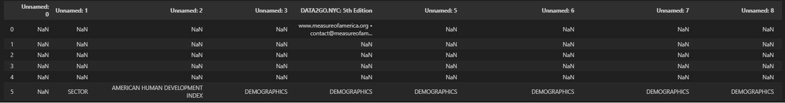
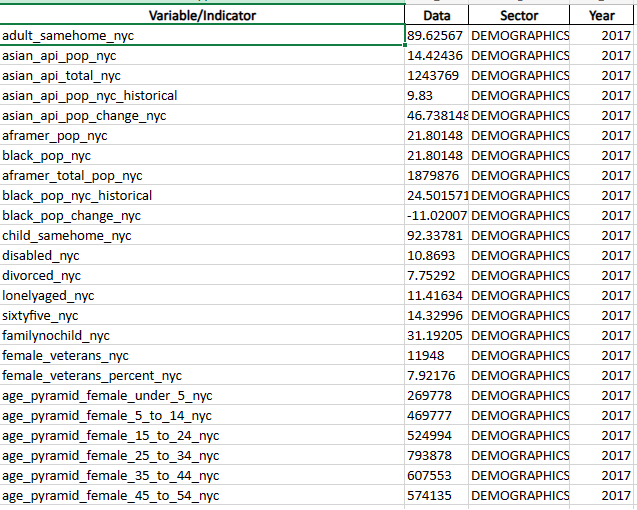

# II. Data Cleaning.

This directory contains the scripts and datasets involved in the data cleaning phase of our project. We use Data2Go's dataset

## Directory Structure

- `images/` - This folder contains images of the data set before and after the data cleaning process.

- `data2go_data_cleaning.ipynb` - A Jupyter notebook detailing the data cleaning steps applied to the `data2gogo.csv` file. It includes code and commentary that explains the rationale behind each data cleaning operation.

- `data2gogo.csv` - The raw dataset as obtained from the initial data sourcing phase. This dataset contains uncleaned data that needs processing.

- `final_data.csv` - The cleaned and processed dataset, which is the output of the `data2go_data_cleaning.ipynb` notebook. This file is ready for further analysis or modeling.

## Usage

To understand and replicate the data cleaning process:

1. Inspect the `data2go_data_cleaning.ipynb` notebook to see the detailed steps taken for cleaning the data.
2. Run the notebook cells in sequence to apply the data cleaning operations to the raw data.
3. Review the `final_data.csv` to ensure the cleaning process has been executed as intended.

## Output
- Pre Cleaned Data 

- In Jupyter Notebook

- Cleaned Data

## Contributing

If you have suggestions for improving the data cleaning process, or if you have applied a new cleaning step that might be beneficial, please feel free to fork this repository, commit your changes, and open a pull request.

