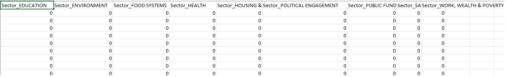

# III.  Feature Engineering

This section of the repository is dedicated to the feature engineering phase, where we transform the cleaned data into a format suitable for clustering.

## Contents

- `final_data.csv` - The dataset resulting from the data cleaning phase, which will undergo feature engineering.

- `notebook.ipynb` - A Jupyter notebook that documents the feature engineering process. It contains the code, explanations, and decision-making rationale for each feature engineering step performed.

- `sector_one_hot_encoded.csv` - This CSV file is the outcome of applying one-hot encoding to the 'sector' feature within our data. It represents a preprocessed form of the `final_data.csv`, specifically transformed for algorithms that require numerical input.

## How to Use

To follow the feature engineering steps:

1. Review the `notebook.ipynb` to understand the feature engineering techniques applied, such as one-hot encoding, normalization, or custom transformations.
2. Execute the notebook to apply these transformations to the `final_data.csv`.
3. Examine the `sector_one_hot_encoded.csv` to ensure the one-hot encoding is correctly applied.

# Output
- Cleaned Data

- One Hot Encoded Sectors

## Contributing

Contributions to this project are welcome. If you have suggestions or improvements for the feature engineering process, please fork the repository, commit your changes, and submit a pull request.

