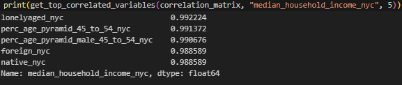

# V. Recommender System Implementation and Correlation Analysis

This directory contains the resources used for conducting a correlation analysis on the dataset and the implementation of the Recommender System using the data produced by the correlations

## Contents

- `correlation_matrix.csv` - A CSV file containing the correlation matrix of the variables in `data.csv`. This matrix quantifies the degree to which the variables in the dataset are linearly related.

- `data.csv` - The processed dataset ready for correlation analysis.

- `notebook.ipynb` - A Jupyter notebook that includes the code for generating the correlation matrix and potentially some visualizations and interpretations. This notebook explains the methodology and the findings of the correlation analysis.

## How to Use

To replicate the correlation analysis or to understand the relationships between the different variables:

1. Start by examining the `notebook.ipynb` for the step-by-step process and the analytical narrative.
2. Execute the notebook to generate the correlation matrix and visualizations.
3. Review the `correlation_matrix.csv` for a tabular representation of the correlations.

## Output
- Heatmap focused on 5 variables (Explore more in notebook.ipynb)

- Output of recommender system ran against "median_household_income_nyc", and returns 5 most correlated variables

## Contributing

Your insights and improvements are valued. If you wish to contribute to this correlation analysis, please fork the repository, make your changes, and create a pull request with a clear explanation of your modifications.

# Donew