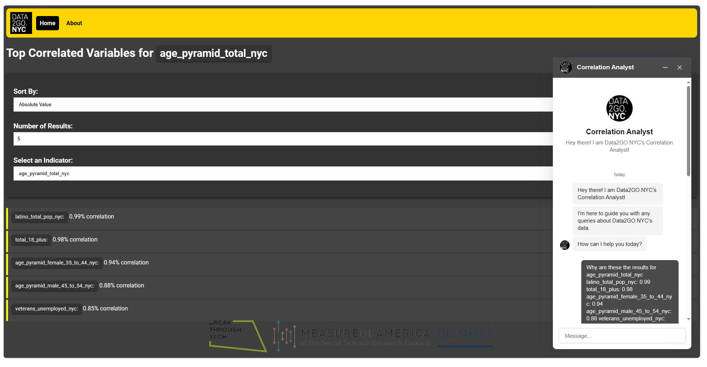

# Social Science Research Council Recommender System and Chatbot

## Introduction
This repository contains the machine learning implementations for a project conducted for the Social Science Research Council. It aims to enhance the user experience on the DATA2GO.NYC website by identifying correlations between variables that users might otherwise overlook. The project's focus is to provide deeper insights and make the data more digestible for users.

## Project Components
- **Recommender System**: Utilizes clustering to suggest variables that correlate with the user's current interest.
- **Chatbot**: An interactive agent that assists users in navigating the DATA2GO.NYC website, answering queries, and providing recommendations based on the underlying data patterns.

## Folder Structure
The repository is organized into several folders, each representing a stage in the development process:
- `I_Data_Collection`: Scripts and notebooks related to data gathering.
- `II_Data_Cleaning`: Tools and techniques used for preparing the data for analysis.
- `III_Feature_Engineering`: Code pertaining to the creation and selection of features for the machine learning models.
- `IV_Clustering`: Implementation of clustering algorithms to group similar data points.
- `V_Recommender_System`: The recommender system's core algorithms and functionality.
- `VI_Chatbot`: Chatbot implementation
- `VII_Implementation`: The integration of the recommender system and chatbot into the DATA2GO.NYC website.

## Implementation 

Full walkthrough Link : (https://clipchamp.com/watch/Y0fgX4MAoRr)

## Usage
To use the recommender system or chatbot, follow the instructions provided in the respective folders. Each folder contains a README with specific setup and execution steps.

## Contributing
Contributions to this project are welcome. Please read the CONTRIBUTING.md file for guidelines on how to make a contribution.

## Acknowledgments
Special thanks 
- The team SSRC1B,
     Labiba Aziz: [Labiba's Github Link](https://github.com/azizlabi)
     Xinyu Huang: [Xinyu's Github Link](https://github.com/Xinyuhh) `del this`
- Social Science Research Council and Measure of America
- Breakthrough Tech AI
- Rebecca Gluskin Deputy Director, Data Scientist at Measure of America 
- Ryan Hardesty Lewis our Mentor

